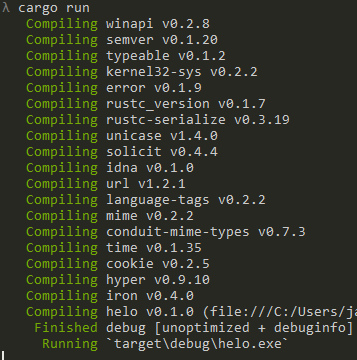
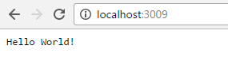
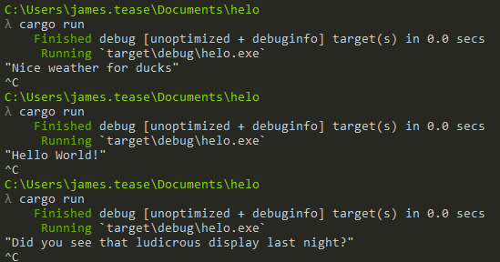
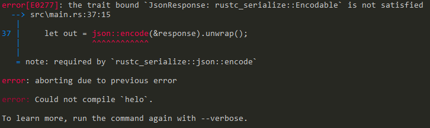
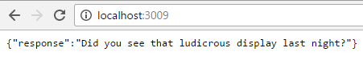
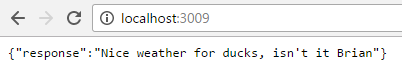

create a new Rust project with
`cargo new hello --bin`

`--bin` flag tells Cargo to create a project which will compile to a binary file, rather than a library.

Add [Iron](https://crates.io/crates/iron) to your dependencies in 'Cargo.toml':

```
[dependencies]
iron = "0.4.0"
```

Update `/src/main.rs` with the code from Iron's ['Hello world' example](http://ironframework.io/doc/iron/#hello-world), and run via `cargo run`. Cargo will install Iron and it's dependencies, so this may take some time, then compile and run the 'hello world' code.

```
extern crate iron;

use iron::prelude::*;
use iron::status;

fn main() {
  Iron::new(|_: &mut Request| {
    Ok(Response::with((status::Ok, "Hello world!")))
  }).http("localhost:3009").unwrap();
}
```




## json

Next, we'll change our response from text to JSON. Based on the [content type example](https://github.com/iron/iron/blob/master/examples/content_type.rs), add the `Mime` import, and update the response:

```
extern crate iron;

use iron::prelude::*;
use iron::status;
use iron::mime::Mime;

fn main() {
  Iron::new(|_: &mut Request| {
    let content_type = "application/json".parse::<Mime>().unwrap();

    Ok(Response::with((content_type, status::Ok, "{ response: \"Hello world!\" }")))
  }).http("localhost:3009").unwrap();
}
```

Let's change the response so it selects a random string. Add the 'rand' crate to the dependencies:

``` Cargo.toml
[dependencies]
iron = "0.4.0"
rand = "0.3"
```

then create a function in `main.rs` which picks a string at random:

```
extern crate rand;      // reference the random crate
extern crate iron;

use iron::prelude::*;
use iron::status;
use iron::mime::Mime;
use rand::Rng;        // use random number generator

// pick a string at random
fn pick_response() -> String {

  // generate a number between 1 and 3 (4 is exclusive upper-bound)
  let num = rand::thread_rng().gen_range(1, 4);

  // match the random number and pick a random string
  let response = match num {
    1 => "Hello World!",
    2 => "Did you see that ludicrous display last night?",
    3 => "Nice weather for ducks",
    _ => ""     // match is exhaustive
  };

  // return our string
  response.to_string()
}

fn main() {
  // check it's working - this will appear in your terminal
  println!("{:?}", pick_response());

  Iron::new(|_: &mut Request| {
    let content_type = "application/json".parse::<Mime>().unwrap();

    Ok(Response::with((content_type, status::Ok, "{ response: \"Hello world!\" }")))
  }).http("localhost:3009").unwrap();
}

```

Run via `cargo run` - if all goes well, you'll see a string printed in the terminal:



Now we need to transform the random string into JSON so we can send it. There's a choice of crates to use here: `rustc-serialize` and `serde-json`. `rustc-serialize` is an older option which isn't very active, while `serde` is actively developed and is the de facto standard for Rust serialisation. However, the downside of `serde` is that you'll need touse the nightly version of Rust, at least until custom traits have been added to the stable branch. [Here's a bit of a comparison between the two.](https://www.reddit.com/r/rust/comments/3v4ktz/differences_between_serde_and_rustc_serialize/).

I'm going to use `rustc-serialize`, since I've found using `serde` a huge pain on Windows.

### add serde
We need the `rustc-serialize` crate, so add it to your dependencies:

``` Cargo.toml
[dependencies]
iron = "0.4.0"
rand = "0.3"
rustc-serialize = "0.3"
```

aaand update the imports in `main.rs`:

```main.rs
extern crate rand;
extern crate iron;
extern crate rustc_serialize;

use iron::prelude::*;
use iron::status;
use iron::mime::Mime;
use rand::Rng;
use rustc_serialize::json;
```

We'll create a struct which holds the response string, and use `serde` to convert it into JSON, which we'll then send as a response.

Create a struct which has one string field, and initialise it in `main()`:

```main.rs
struct JsonResponse {
  response: String
}

fn main() {
  println!("{:?}", pick_response());

  Iron::new(|_: &mut Request| {
    let content_type = "application/json".parse::<Mime>().unwrap();

    // create the response
    let response = JsonResponse { response: pick_response() };

    // convert the response struct to JSON
    let out = json::encode(&response).unwrap();

    Ok(Response::with((content_type, status::Ok, out)))
  }).http("localhost:3009").unwrap();
}

```

If you try to run this, you'll get an error complaining that our struct doesn't satisfy the `Encodable` trait:



so add the appropriate derive to our struct:

```main.rs
#[derive(RustcEncodeable)]
struct JsonResponse {
  response: String
}
```
and run:



## get and post
Let's edit the reponse so we can take a parameter from get or post, and display it back. Update `pick_response` so it takes a name, and returns a formatted string:

```
fn pick_response(name: String) -> String {
  let num = rand::thread_rng().gen_range(1, 4);

  let response = match num {
    1 => format!("Hello {}!", name),
    2 => format!("Did you see that ludicrous display last night, {}?", name),
    3 => format!("Nice weather for ducks, isn't it {}", name),
    _ => format!("")     // match is exhaustive
  };

  response.to_string()
}
```

We also need to install 'router' so we have a way of defining routes in Iron:

```
[dependencies]
iron = "0.4.0"
rustc-serialize = "0.3"
rand = "0.3"
router = "0.4.0"
```

Now update `main()` to seperate the route handler

```
extern crate router;

use router::Router;
use std::io::Read;

fn handler(req: &mut Request) -> IronResult<Response> {
  let response = JsonResponse { response: pick_response("Brian".to_string()) };
  let out = json::encode(&response).unwrap();

  let content_type = "application/json".parse::<Mime>().unwrap();
  Ok(Response::with((content_type, status::Ok, out)))
}

fn main() {
  let mut router = Router::new();
  router.get("/", handler, "index");

  Iron::new(router).http("localhost:3009").unwrap();
}
```

This moves the handler for `GET` requests to the index into its own function, which now also passes a string to `pick_response` since there are no parameters in the default request. Adding a route for a `POST` request is very similar:

```
// make sure we can encode and decode from this struct (for post)
#[derive(RustcEncodable, RustcDecodable)]
struct JsonResponse {
  response: String
}


fn handler(req: &mut Request) -> IronResult<Response> {
  let response = JsonResponse { response: pick_response("Brian".to_string()) };
  let out = json::encode(&response).unwrap();

  let content_type = "application/json".parse::<Mime>().unwrap();
  Ok(Response::with((content_type, status::Ok, out)))
}

fn post_handler(req: &mut Request) -> IronResult<Response> {
  let mut payload = String::new();

  // read the POST body
  req.body.read_to_string(&mut payload).unwrap();
  println!("{:?}", payload);

  // we're expecting the POST to match the format of our JsonResponse struct
  // ie { "response": "Brian" }
  let incoming: JsonResponse = json::decode(&payload).unwrap();

  // create a response with our random string, and pass in the string from the POST body
  let response = JsonResponse { response: pick_response(incoming.response) };
  let out = json::encode(&response).unwrap();

  let content_type = "application/json".parse::<Mime>().unwrap();
  Ok(Response::with((content_type, status::Ok, out)))
}

fn main() {
  let mut router = Router::new();
  router.get("/", handler, "index");
  router.post("/", post_handler, "post_name");

  Iron::new(router).http("localhost:3009").unwrap();
}
```

Now, when we visit the homepage, we get a random phrase with "Brian":



and with a POST request, we get a response with the name we send:

```
curl -X POST -d '{ "response":"Bob" }' http://localhost:3009
{"response":"Did you see that ludicrous display last night, Bob?"}
```

Full programme so far:

```
extern crate rand;
extern crate iron;
extern crate rustc_serialize;
extern crate router;

use iron::prelude::*;
use iron::status;
use iron::mime::Mime;
use rand::Rng;
use rustc_serialize::json;
use router::Router;
use std::io::Read;

#[derive(RustcEncodeable)]
struct JsonResponse {
  response: String
}

fn pick_response(name: String) -> String {
  let num = rand::thread_rng().gen_range(1, 4);

  let response = match num {
    1 => format!("Hello {}!", name),
    2 => format!("Did you see that ludicrous display last night, {}?", name),
    3 => format!("Nice weather for ducks, isn't it {}", name),
    _ => format!("")     // match is exhaustive
  };

  response.to_string()
}

fn handler(req: &mut Request) -> IronResult<Response> {
  let response = JsonResponse { response: pick_response("Brian".to_string()) };
  let out = json::encode(&response).unwrap();

  let content_type = "application/json".parse::<Mime>().unwrap();
  Ok(Response::with((content_type, status::Ok, out)))
}

fn post_handler(req: &mut Request) -> IronResult<Response> {
  let mut payload = String::new();

  // read the POST body
  req.body.read_to_string(&mut payload).unwrap();
  println!("{:?}", payload);

  // we're expecting the POST to match the format of our JsonResponse struct
  // ie { "response": "Brian" }
  let incoming: JsonResponse = json::decode(&payload).unwrap();

  // create a response with our random string, and pass in the string from the POST body
  let response = JsonResponse { response: pick_response(incoming.response) };
  let out = json::encode(&response).unwrap();

  let content_type = "application/json".parse::<Mime>().unwrap();
  Ok(Response::with((content_type, status::Ok, out)))
}

fn main() {
  let mut router = Router::new();
  router.get("/", handler, "index");
  router.post("/", post_handler, "post_name");

  Iron::new(router).http("localhost:3009").unwrap();
}
```

## error

Now everything's working, let's tidy up a bit. Using `unwrap()` is fine for prototyping, but not great for production code since any problems will cause the programme to panic, and show an ugly error message to the user. Sending a POST request without the `response` valuse set causes this error:

```
// attribute is supposed to be 'response' not 'name'
curl -X POST -d '{ "name":"Bob" }' http://localhost:3009

thread '<unnamed>' panicked at 'called `Result::unwrap()` on an `Err` value: MissingFieldError("response")', ../src/libcore\result.rs:788
note: Run with `RUST_BACKTRACE=1` for a backtrace.
```

Similarly, if you send the correct values but invalid JSON, you also get an error:

```
// response needs to be in quotes
curl -X POST -d '{ response:"Bob" }' http://localhost:3009

thread '<unnamed>' panicked at 'called `Result::unwrap()` on an `Err` value: ParseError(SyntaxError("key must be a string", 1, 3))', ../src/libcore\result.rs:788
```

And sending non-JSON:

```
curl -X POST -d "Bob" http://localhost:3009

thread '<unnamed>' panicked at 'called `Result::unwrap()` on an `Err` value: ParseError(SyntaxError("invalid syntax", 1, 1))', ../src/libcore\result.rs:788
```

We'll work through the `post_handler` function and update the `unwrap` calls to use `match`, so we can handle errors. If we encounter an error, we'll send that back via JSON, so the first thing to do is to update the `JsonResponse` struct to indicate if there is an error, and if so, what the error message was. It'd get a bit boring to type out the default success and error messages, so we'll also add a couple of functions to create `JsonResponse` structs:

```
#[derive(RustcEncodable, RustcDecodable)]
struct JsonResponse {
  response: String,
  success: bool,
  error_message: String
}

impl JsonResponse {
  fn success(response: String) -> Self {
    JsonResponse { response: response, success: true, error_message: "".to_string() }
  }

  fn error(msg: String) -> Self {
    JsonResponse { response: "".to_string(), success: false, error_message: msg }
  }
}
```

(whether or not it's a good idea to send raw error messages to users I'll leave up to you). We'll also need a new struct for incoming requests, since users don't need to send 'success' or 'error_message' fields:

```
#[derive(RustcDecodable)]
struct JsonRequest {
  response: String
}
```

and then update all our existing calls to the struct.

```
fn handler(req: &mut Request) -> IronResult<Response> {
  // use the success fn
  let response = JsonResponse::success(response: pick_response("Brian".to_string()));
  let out = json::encode(&response).unwrap();

  let content_type = "application/json".parse::<Mime>().unwrap();
  Ok(Response::with((content_type, status::Ok, out)))
}

fn post_handler(req: &mut Request) -> IronResult<Response> {
  let mut payload = String::new();
  req.body.read_to_string(&mut payload).unwrap();
  println!("{:?}", payload);

  // use the JsonRequest struct, since incoming will just have the name
  let incoming: JsonRequest = json::decode(&payload).unwrap();

  // update to use success fn
  let response = JsonResponse::success(response: pick_response(incoming.response));
  let out = json::encode(&response).unwrap();

  let content_type = "application/json".parse::<Mime>().unwrap();
  Ok(Response::with((content_type, status::Ok, out)))
}
```

In `post_handler`, we can now use a `match` to check if the incoming JSON is correct, rather than an `unwrap` call. If there is an error, then we create a response with the error message and send that; if not, we can respond as usual.

```
fn post_handler(req: &mut Request) -> IronResult<Response> {
  let mut payload = String::new();
  req.body.read_to_string(&mut payload).unwrap();
  println!("{:?}", payload);

  let out = match json::decode(&payload) {
    Err(e) => {
      let response = JsonResponse::error(format!("Error parsing JSON: {:?}", e));
      json::encode(&response).unwrap()
    },
    Ok(incoming) => {
      // Rust needs to know the type of incoming before we can use it in get_name, so set to a variable with a type
      let converted: JsonRequest = incoming;
      let response = JsonResponse::success(get_name(converted.name));
      json::encode(&response).unwrap()
    }
  };

  // print out the JSON as usual
  let content_type = "application/json".parse::<Mime>().unwrap();
  Ok(Response::with((content_type, status::Ok, out)))
}
```

Error response:
```
curl -X POST -d '{ invalid: "Bob" }' http://localhost:3009

{"name":"","success":false,"error_message":"Error parsing JSON: ParseError(SyntaxError(\"key must be a string\", 1, 3))"}
```

Normal response:
```
curl -X POST -d '{ "name":"Bob" }' http://localhost:3009

{"name":"Hello Bob!","success":true,"error_message":""}
```

We've also got an `unwrap` when reading the request body:
```
req.body.read_to_string(&mut payload).unwrap();
```

If something goes wrong here, then it's likely that the post body is completely malformed and we can't use it, so we may as well stop trying to handle this request. If we fail out of this function, the server will still be listening for more requests so won't crash entirely, so we can replace `unwrap` with `expect`. `expect` is very similar to `unwrap` in that it panics on error, except it allows you to define your own error message so it's clear what happened.

```
req.body.read_to_string(&mut payload).expect("Failed to read request body");
```

Similarly, the `json::encode` lines in the match statement can use `expect` rather than `unwrap` - in this case, something's gone wrong when with the JSON encoder, so we're not able to prepare JSON to send back to the user.

The final `unwrap` in this function is in setting the content type; again, an `expect` seems appropriate since this should just indicate programmer error.

```
fn post_handler(req: &mut Request) -> IronResult<Response> {
  let mut payload = String::new();
  req.body.read_to_string(&mut payload).expect("Failed to read request body");

  // let incoming: JsonResponse = json::decode(&payload).ok().expect("Invalid JSON in POST body");
  let out = match json::decode(&payload) {
    Err(e) => {
      let response = JsonResponse::error(format!("Error parsing JSON: {:?}", e));
      json::encode(&response).ok().expect("Error encoding response")
    },
    Ok(incoming) => {
      let converted: JsonRequest = incoming;
      let response = JsonResponse::success(get_name(converted.name));
      json::encode(&response).expect("Error encoding response")
    }
  };

  let content_type = "application/json".parse::<Mime>().expect("Failed to parse mime type");
  Ok(Response::with((content_type, status::Ok, out)))
}
```


Full programme so far:

```
extern crate rand;
extern crate iron;
extern crate rustc_serialize;
extern crate router;

use iron::prelude::*;
use iron::status;
use iron::mime::Mime;
use rand::Rng;
use rustc_serialize::json;
use router::Router;
use std::io::Read;

#[derive(RustcDecodable)]
struct JsonRequest {
  name: String
}

#[derive(RustcEncodable, RustcDecodable)]
struct JsonResponse {
  response: String,
  success: bool,
  error_message: String
}

impl JsonResponse {
  fn success(response: String) -> Self {
    JsonResponse { response: response, success: true, error_message: "".to_string() }
  }

  fn error(msg: String) -> Self {
    JsonResponse { response: "".to_string(), success: false, error_message: msg }
  }
}

fn pick_response(name: String) -> String {
  let num = rand::thread_rng().gen_range(1, 4);

  let response = match num {
    1 => format!("Hello {}!", name),
    2 => format!("Did you see that ludicrous display last night, {}?", name),
    3 => format!("Nice weather for ducks, isn't it {}", name),
    _ => format!("")     // match is exhaustive
  };

  response.to_string()
}

fn handler(req: &mut Request) -> IronResult<Response> {
  let response = JsonResponse::success(response: pick_response("Brian".to_string()));
  let out = json::encode(&response).expect("Failed to encode response");

  let content_type = "application/json".parse::<Mime>().expect("Failed to parse content type");
  Ok(Response::with((content_type, status::Ok, out)))
}

fn post_handler(req: &mut Request) -> IronResult<Response> {
  let mut payload = String::new();
  req.body.read_to_string(&mut payload).expect("Failed to read request body");

  // let incoming: JsonResponse = json::decode(&payload).ok().expect("Invalid JSON in POST body");
  let out = match json::decode(&payload) {
    Err(e) => {
      let response = JsonResponse::error(format!("Error parsing JSON: {:?}", e));
      json::encode(&response).ok().expect("Error encoding response")
    },
    Ok(incoming) => {
      let converted: JsonRequest = incoming;
      let response = JsonResponse::success(get_name(converted.name));
      json::encode(&response).expect("Error encoding response")
    }
  };

  let content_type = "application/json".parse::<Mime>().expect("Failed to parse content type");
  Ok(Response::with((content_type, status::Ok, out)))
}

fn main() {
  let mut router = Router::new();
  router.get("/", handler, "index");
  router.post("/", post_handler, "post_name");

  println!("Listening on localhost:3009");
  Iron::new(router).http("localhost:3009").ok();
}
```


## deploy

Deploying is as simple as transferring your files to the server and running `cargo build --release`.

## nginx
https://medium.com/@rap2h/a-rust-powered-public-website-in-5-minutes-b682d8527b6b#.qss96nzf2